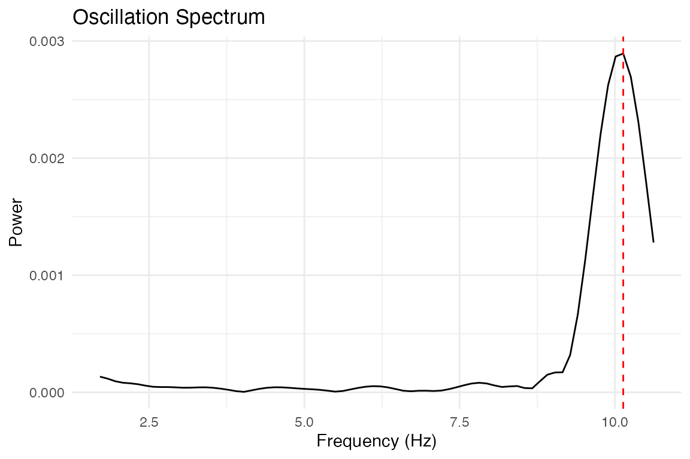
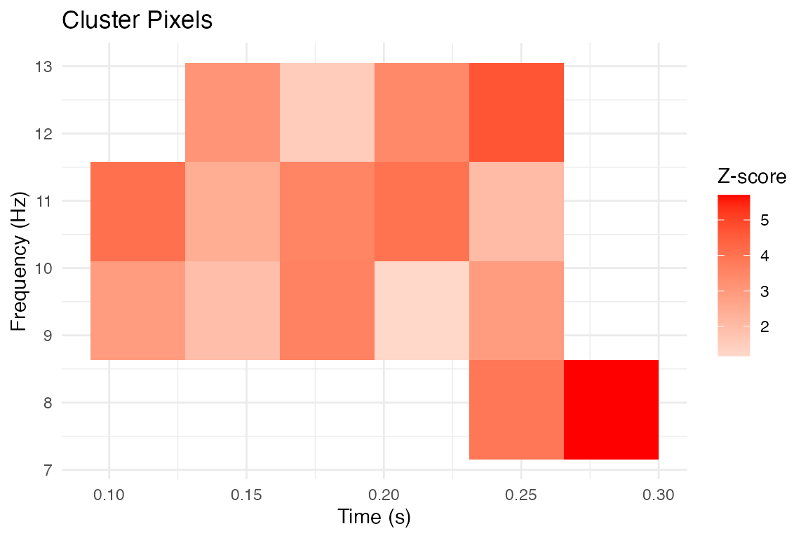

# Workflow Wrappers

## Introduction

The **bosc** package provides low-level functions for oscillation
analysis, but also includes high-level workflow wrappers that simplify
common analysis patterns. These wrappers are designed to: - Accept
configuration lists for reproducible, programmatic analyses - Combine
multiple steps (e.g., compute score + surrogates + significance) in one
call - Provide tidy output formats for easy integration with tidyverse
workflows

For the underlying algorithms, see
[`vignette("oscillation-score")`](../articles/oscillation-score.md) and
[`vignette("ppc-clustering")`](../articles/ppc-clustering.md).

``` r
library(bosc)
```

## Quick Start: One-Call Significance Testing

The most common workflow is computing an oscillation score and testing
its significance against surrogates.
[`oscillation_score_z()`](../reference/oscillation_score_z.md) does this
in one call:

``` r
# Generate a signal with 10 Hz periodicity
set.seed(42)
fs <- 1000
sig <- numeric(fs * 2)
spike_times <- seq(50, 1950, by = 100) + round(rnorm(20, sd = 5))
spike_times <- spike_times[spike_times > 0 & spike_times <= length(sig)]
sig[spike_times] <- 1

# One-call analysis: compute oscore, surrogates, and z-score
result <- oscillation_score_z(
  signal = sig,
  fs = fs,
  flim = c(5, 20),
  nrep = 200,
  alpha = 0.05,
  taper = "hanning"
)

cat("Oscillation score:", round(result$oscore, 3), "\n")
#> Oscillation score: 1.17
cat("Peak frequency:", round(result$fosc, 2), "Hz\n")
#> Peak frequency: 7.82 Hz
cat("Z-score:", round(result$z, 2), "\n")
#> Z-score: -1.46
cat("P-value:", format(result$pval, digits = 3), "\n")
#> P-value: 0.928
cat("Significant:", result$significant, "\n")
#> Significant: FALSE
```

## Configuration-List Workflows

When running batch analyses across subjects or conditions, it’s
convenient to define parameters once and reuse them. The `_config`
wrappers accept named lists:

### Basic Config-Driven Analysis

``` r
# Define analysis parameters
config <- list(
  fs = 1000,
  flim = c(1, 50),
  quantlim = c(0.05, 0.95),
  smoothach = TRUE,
  smoothwind = 0.002,
  peakwind = 0.008,
  taper = "hanning",
  warnings = "off"
)

# Apply to signal
os <- oscillation_score_config(config, sig)

cat("Oscillation score:", round(os$oscore, 3), "\n")
#> Oscillation score: 43.858
cat("Peak frequency:", round(os$fosc, 2), "Hz\n")
#> Peak frequency: 10.13 Hz
```

### Surrogate Config Workflow

``` r
# Extend config for surrogate analysis
config_sur <- modifyList(config, list(
  nrep = 200,
  fpeak = os$fosc,
  keep_trend = FALSE
))

sur <- oscillation_score_surrogates_config(config_sur, sig)

# Compute statistics from surrogate distribution
z <- (log(os$oscore) - mean(log(sur$oscore_rp), na.rm = TRUE)) /
     sd(log(sur$oscore_rp), na.rm = TRUE)

cat("Surrogate mean:", round(mean(sur$oscore_rp), 3), "\n")
#> Surrogate mean: 4.293
cat("Surrogate SD:", round(sd(sur$oscore_rp), 3), "\n")
#> Surrogate SD: 3.128
cat("Log-Z score:", round(z, 2), "\n")
#> Log-Z score: 3.13
```

### Batch Analysis Example

``` r
# Simulate multiple subjects with varying oscillation strength
set.seed(123)
n_subjects <- 5

# Create subjects with different oscillation strengths
subjects <- lapply(1:n_subjects, function(i) {
  sig <- numeric(2000)
  # Vary jitter: stronger oscillation = less jitter
  jitter_sd <- 5 + (i - 1) * 3
  spikes <- seq(50, 1950, by = 100) + round(rnorm(20, sd = jitter_sd))
  spikes <- spikes[spikes > 0 & spikes <= 2000]
  sig[spikes] <- 1
  sig
})

# Apply same config to all subjects
results <- lapply(subjects, function(s) {
  oscillation_score_z(s, fs = 1000, flim = c(5, 20), nrep = 100, tidy = TRUE)
})

# Combine results
batch_results <- do.call(rbind, results)
batch_results$subject <- 1:n_subjects
print(batch_results[, c("subject", "oscore", "fosc", "z", "significant")])
#>    subject   oscore     fosc        z significant
#> 1        1 44.81143 9.775171 4.058299        TRUE
#> 2        2 44.81143 9.775171 4.058299        TRUE
#> 3        3 48.91388 9.775171 4.222812        TRUE
#> 4        4 48.91388 9.775171 4.222812        TRUE
#> 5        5 40.35858 9.775171 3.303521        TRUE
#> 6        1 40.35858 9.775171 3.303521        TRUE
#> 7        2 26.09299 9.775171 2.600084        TRUE
#> 8        3 26.09299 9.775171 2.600084        TRUE
#> 9        4 26.60936 9.775171 2.669158        TRUE
#> 10       5 26.60936 9.775171 2.669158        TRUE
```

## Phase at Event Times

A common analysis extracts the instantaneous phase of an oscillation at
specific event times (e.g., button presses, stimulus onsets).
[`phase_at_events()`](../reference/phase_at_events.md) handles the full
pipeline:

1.  Convert event times to a continuous trace

2.  Narrowband filter at the frequency of interest

3.  Extract Hilbert phase at each event

``` r
# Event times in seconds (e.g., button presses)
events <- c(0.15, 0.25, 0.35, 0.45, 0.55, 0.65, 0.75, 0.85, 0.95)

# Extract phase at 10 Hz
phases <- phase_at_events(
  events = events,
  dt = 0.001,      # 1 ms time resolution
  fosc = 10,       # Center frequency
  bandwidth = 1    # +/- 1 Hz band
)

cat("Phases at events (radians):\n")
#> Phases at events (radians):
print(round(phases, 2))
#> [1] -0.01  0.00  0.00 -0.01 -0.01 -0.01  0.02  0.13  1.52

# Check phase consistency
cat("\nMean resultant length:", round(circ_r(phases), 3), "\n")
#> 
#> Mean resultant length: 0.902
ray <- circ_rayleigh(phases)
cat("Rayleigh p-value:", format(ray$pval, digits = 3), "\n")
#> Rayleigh p-value: 2.93e-05
```

### Leave-One-Out Phase Estimation

For unbiased phase estimation (avoiding circular analysis), use
leave-one-out:

``` r
# Each event's phase is computed from a trace excluding that event
phases_loo <- phase_at_events(
  events = events,
  dt = 0.001,
  fosc = 10,
  bandwidth = 1,
  leave_one_out = TRUE
)
```

## Tidy Output Helpers

The package includes helper functions to convert results to tidy
data.frames, making it easy to combine results across analyses or use
with ggplot2/dplyr. \### oscore_tidy: Oscillation Score Summaries

``` r
# Single result
oscore_tidy(os)
#>     oscore     fosc     fmin     fmax
#> 1 43.85796 10.13431 1.681614 10.65022

# Can also handle oscillation_score_z output
z_result <- oscillation_score_z(sig, fs = 1000, flim = c(5, 20), nrep = 50)
oscore_tidy(z_result)
#>    oscore     fosc fmin     fmax        z      pval significant
#> 1 4.90813 7.331378    5 10.50972 0.334394 0.3690411       FALSE
```

### oscore_spectrum: Extract Spectrum Data

``` r
# Get spectrum as a data.frame for plotting
spec_df <- oscore_spectrum(os)
head(spec_df)
#>       freq        power
#> 1 1.709402 1.338058e-04
#> 2 1.831502 1.166433e-04
#> 3 1.953602 9.469540e-05
#> 4 2.075702 8.186402e-05
#> 5 2.197802 7.682177e-05
#> 6 2.319902 6.915301e-05

# Plot with ggplot2
if (requireNamespace("ggplot2", quietly = TRUE)) {
  library(ggplot2)
  ggplot(spec_df, aes(x = freq, y = power)) +
    geom_line() +
    geom_vline(xintercept = os$fosc, linetype = "dashed", color = "red") +
    labs(x = "Frequency (Hz)", y = "Power", title = "Oscillation Spectrum") +
    theme_minimal()
}
#> Warning: package 'ggplot2' was built under R version 4.5.2
```



### clusters_tidy: Cluster Summaries

After detecting clusters in time-frequency maps, convert to tidy format:

``` r
# Create example time-frequency data with clusters
set.seed(456)
n_freq <- 20
n_time <- 30
t_matrix <- matrix(rnorm(n_freq * n_time), nrow = n_freq)
# Add cluster
t_matrix[5:8, 10:15] <- t_matrix[5:8, 10:15] + 3

# Detect clusters
freq_axis <- seq(2, 30, length.out = n_freq)
time_axis <- seq(-0.2, 0.8, length.out = n_time)

clusters <- detect_clusters(
  data = t_matrix,
  threshold = 2.0,
  method = "extract",
  smooth = 1,
  freq_axis = freq_axis,
  time_axis = time_axis
)

# Convert to tidy summary
cluster_summary <- clusters_tidy(clusters)
print(cluster_summary[, c("cluster", "n_pixels", "freq_min", "freq_max",
                          "time_min", "time_max", "sumZscore")])
#>   cluster n_pixels freq_min freq_max  time_min  time_max sumZscore
#> 1       1       16 7.894737 12.31579 0.1103448 0.2827586  50.89751
```

### clusters_pixels: Per-Pixel Data

For detailed analysis or custom plotting, get all cluster pixels:

``` r
# Get all pixels from detected clusters
pixel_df <- clusters_pixels(clusters)
head(pixel_df)
#>   cluster      time      freq   Zscore pAdj
#> 1       1 0.1103448  9.368421 2.899204   NA
#> 2       1 0.1103448 10.842105 4.070153   NA
#> 3       1 0.1448276  9.368421 1.927576   NA
#> 4       1 0.1448276 10.842105 2.432312   NA
#> 5       1 0.1448276 12.315789 3.129383   NA
#> 6       1 0.1793103  9.368421 3.600278   NA

# Example: plot cluster extent
if (requireNamespace("ggplot2", quietly = TRUE) && nrow(pixel_df) > 0) {
  ggplot(pixel_df, aes(x = time, y = freq, fill = Zscore)) +
    geom_tile() +
    scale_fill_gradient2(low = "blue", mid = "white", high = "red", midpoint = 0) +
    labs(x = "Time (s)", y = "Frequency (Hz)", fill = "Z-score",
         title = "Cluster Pixels") +
    theme_minimal()
}
```



## Complete Analysis Pipeline

Here’s a complete example combining the workflow wrappers:

``` r
set.seed(789)

# 1. Generate behavioral data with oscillatory structure
fs <- 1000
duration <- 3
n_samples <- fs * duration

# Response times with 8 Hz periodicity
base_times <- seq(0.1, 2.9, by = 0.125)  # 8 Hz
event_times <- base_times + rnorm(length(base_times), sd = 0.01)
event_times <- sort(event_times[event_times > 0 & event_times < duration])

# Convert to spike train
sig <- numeric(n_samples)
sig[round(event_times * fs)] <- 1

# 2. Compute oscillation score with significance
config <- list(
  fs = fs,
  flim = c(4, 15),
  nrep = 200,
  alpha = 0.05,
  taper = "hanning"
)

z_result <- oscillation_score_z(
  signal = sig,
  fs = config$fs,
  flim = config$flim,
  nrep = config$nrep,
  alpha = config$alpha,
  taper = config$taper
)

# 3. Extract phases at response times
phases <- phase_at_events(
  events = event_times,
  dt = 1/fs,
  fosc = z_result$fosc,
  bandwidth = 1
)

# 4. Test phase consistency
ray <- circ_rayleigh(phases)

# 5. Report results
cat("=== Oscillation Analysis Results ===\n\n")
#> === Oscillation Analysis Results ===

cat("Oscillation Score Analysis:\n")
#> Oscillation Score Analysis:
cat(sprintf("  O-score: %.3f\n", z_result$oscore))
#>   O-score: 50.978
cat(sprintf("  Peak frequency: %.2f Hz\n", z_result$fosc))
#>   Peak frequency: 7.82 Hz
cat(sprintf("  Z-score: %.2f\n", z_result$z))
#>   Z-score: 3.44
cat(sprintf("  P-value: %.4f\n", z_result$pval))
#>   P-value: 0.0003
cat(sprintf("  Significant: %s\n\n", z_result$significant))
#>   Significant: TRUE

cat("Phase Consistency:\n")
#> Phase Consistency:
cat(sprintf("  Mean phase: %.2f rad\n", circ_mean(phases)))
#>   Mean phase: 0.07 rad
cat(sprintf("  Resultant length: %.3f\n", circ_r(phases)))
#>   Resultant length: 0.904
cat(sprintf("  Rayleigh p-value: %.4f\n", ray$pval))
#>   Rayleigh p-value: 0.0000
```

## Summary of Workflow Functions

| Function | Purpose | Key Benefit |
|----|----|----|
| [`oscillation_score_z()`](../reference/oscillation_score_z.md) | O-score + surrogates + z-score | One-call significance testing |
| [`oscillation_score_config()`](../reference/oscillation_score_config.md) | Config-driven O-score | Batch processing, reproducibility |
| [`oscillation_score_surrogates_config()`](../reference/oscillation_score_surrogates_config.md) | Config-driven surrogates | Batch processing |
| [`phase_at_events()`](../reference/phase_at_events.md) | Extract phases at event times | Full pipeline in one call |
| [`oscore_tidy()`](../reference/oscore_tidy.md) | Convert results to data.frame | Tidyverse integration |
| [`oscore_spectrum()`](../reference/oscore_spectrum.md) | Extract spectrum as data.frame | Easy plotting |
| [`clusters_tidy()`](../reference/clusters_tidy.md) | Summarize clusters | Quick cluster statistics |
| [`clusters_pixels()`](../reference/clusters_pixels.md) | Per-pixel cluster data | Custom analyses/plotting |

## Session Info

``` r
sessionInfo()
#> R version 4.5.1 (2025-06-13)
#> Platform: aarch64-apple-darwin20
#> Running under: macOS Sonoma 14.3
#> 
#> Matrix products: default
#> BLAS:   /Library/Frameworks/R.framework/Versions/4.5-arm64/Resources/lib/libRblas.0.dylib 
#> LAPACK: /Library/Frameworks/R.framework/Versions/4.5-arm64/Resources/lib/libRlapack.dylib;  LAPACK version 3.12.1
#> 
#> locale:
#> [1] en_CA.UTF-8/en_CA.UTF-8/en_CA.UTF-8/C/en_CA.UTF-8/en_CA.UTF-8
#> 
#> time zone: America/Toronto
#> tzcode source: internal
#> 
#> attached base packages:
#> [1] stats     graphics  grDevices utils     datasets  methods   base     
#> 
#> other attached packages:
#> [1] ggplot2_4.0.1   bosc_0.0.0.9000
#> 
#> loaded via a namespace (and not attached):
#>  [1] sass_0.4.10        generics_0.1.4     tiff_0.1-12        jpeg_0.1-11       
#>  [5] stringi_1.8.7      pracma_2.4.6       digest_0.6.39      magrittr_2.0.4    
#>  [9] evaluate_1.0.5     grid_4.5.1         RColorBrewer_1.1-3 fastmap_1.2.0     
#> [13] jsonlite_2.0.0     purrr_1.2.0        scales_1.4.0       textshaping_1.0.4 
#> [17] jquerylib_0.1.4    cli_3.6.5          rlang_1.1.6        withr_3.0.2       
#> [21] cachem_1.1.0       yaml_2.3.12        tools_4.5.1        dplyr_1.1.4       
#> [25] vctrs_0.6.5        R6_2.6.1           png_0.1-8          bmp_0.3.1         
#> [29] lifecycle_1.0.4    stringr_1.6.0      fs_1.6.6           htmlwidgets_1.6.4 
#> [33] MASS_7.3-65        ragg_1.5.0         pkgconfig_2.0.3    desc_1.4.3        
#> [37] pkgdown_2.2.0      pillar_1.11.1      bslib_0.9.0        gtable_0.3.6      
#> [41] glue_1.8.0         Rcpp_1.1.0         systemfonts_1.3.1  xfun_0.54         
#> [45] tibble_3.3.0       tidyselect_1.2.1   knitr_1.50         farver_2.1.2      
#> [49] readbitmap_0.1.5   htmltools_0.5.9    imager_1.0.5       igraph_2.2.1      
#> [53] rmarkdown_2.30     labeling_0.4.3     signal_1.8-1       compiler_4.5.1    
#> [57] S7_0.2.1
```
